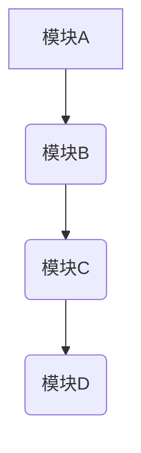

# 算法训练营第一周：学习笔记

|数据结构|优点|缺点|
|---|---|---|
|数组|连续存储，随机访问复杂度O(1)|插入、删除复杂度O(n)|
|链表|分散存储，插入、删除复杂度O(1)|随机访问复杂度O(n)|
|栈|先入后出，入栈、出栈复杂度都是O(1)|栈是一种操作受限制的数据结构|
|队列|先入先出||

```
code module
```


```mermaid
graph TD
A[模块A] --> B(模块B)
B --> C(模块C)
C --> D(模块D)
```

